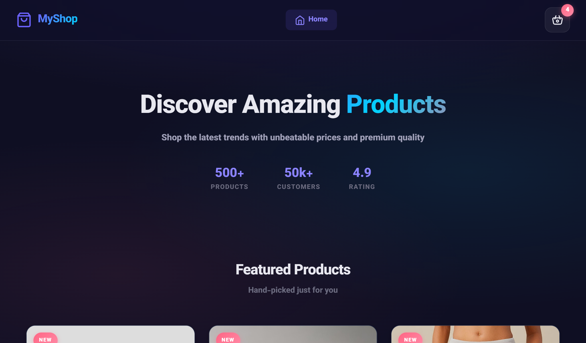

<div dir="rtl">

<div align="center">



</div>

<br><br>

# 🛒 فروشگاه آنلاین

### جلسه ۹ و ۱۰ — قالب فرانت‌اند فروشگاهی مدرن و واکنش‌گرا

<br>

[](https://developer.mozilla.org/en-US/docs/Web/HTML)
[](https://developer.mozilla.org/en-US/docs/Web/CSS)
[](https://developer.mozilla.org/en-US/docs/Web/JavaScript)
[](https://axios-http.com/)

[](https://opensource.org/licenses/MIT)
[](http://makeapullrequest.com)
[](https://github.com/username/repo/graphs/commit-activity)

<br>

</div>

> [!CAUTION]  
> ⚠️ **هشدار مهم**  
> این قالب صرفاً برای **مصارف آموزشی** تهیه شده است و بهتر است بدون بررسی کامل، تست‌های امنیتی و ملاحظات فنی لازم، به صورت تجاری استفاده نشود.

---

## 📑 فهرست مطالب

- [✨ ویژگی‌ها](#-ویژگیها)
- [🚀 نصب و راه‌اندازی](#-نصب-و-راهاندازی)
- [📁 ساختار پروژه](#-ساختار-پروژه)
- [📖 آموزش کد — فایل `index.js`](#-آموزش-کد--فایل-indexjs)
  - [۱. آبجکت‌ها و آرایه‌ها](#۱-آبجکتها-و-آرایهها-در-جاوااسکریپت)
  - [۲. دریافت محصولات از API](#۲-تابع-دریافت-محصولات-از-api)
  - [۳. انتخاب المان‌های HTML](#۳-انتخاب-المانهای-html-با-جاوااسکریپت)
  - [۴. فراخوانی API](#۴-فراخوانی-api)
  - [۵. بروزرسانی سبد خرید](#۵-تابع-بروزرسانی-سبد-خرید)
  - [۶. نمایش محصولات](#۶-نمایش-محصولات)
  - [۷. کد کامنت‌شده — نمایش چند تصویر](#۷-کد-کامنتشده--نمایش-چند-تصویر)
  - [۸. رویداد کلیک — افزودن به سبد خرید](#۸-رویداد-کلیک--افزودن-به-سبد-خرید)
  - [۹. کد کامنت‌شده — روش اشتباه](#۹-کد-کامنتشده--روش-اشتباه)
  - [۱۰. مدیریت محصولات تکراری](#۱۰-روش-صحیح--مدیریت-محصولات-تکراری)
  - [۱۱. تنظیم اطلاعات کارت](#۱۱-تنظیم-اطلاعات-کارت)
- [📖 آموزش کد — فایل `product.js`](#-آموزش-کد--فایل-productjs)
  - [۱. DOMContentLoaded](#۱-domcontentloaded-event)
  - [۲. خواندن پارامتر URL](#۲-خواندن-پارامتر-url)
  - [۳. گالری تصاویر](#۳-گالری-تصاویر)
  - [۴. مودال زوم تصویر](#۴-مودال-زوم-تصویر)
  - [۵. دکمه علاقه‌مندی‌ها](#۵-دکمه-علاقهمندیها-wishlist)
  - [۶. انتخاب تعداد محصول](#۶-انتخاب-تعداد-محصول)
  - [۷. سیستم تب‌ها](#۷-سیستم-تبها)
  - [۸. کپی لینک](#۸-کپی-لینک-با-clipboard-api)
  - [۹. Toast Notification](#۹-سیستم-toast-notification)
  - [۱۰. Intersection Observer](#۱۰-intersection-observer)
- [🎯 نکات مهم برای مبتدیان](#-نکات-مهم-برای-مبتدیان)
- [🤝 مشارکت](#-مشارکت)
- [📝 لایسنس](#-لایسنس)

---

## ✨ ویژگی‌ها

| ویژگی | توضیح                                  |
|:-----:|:---------------------------------------|
| 🎨    | طراحی مدرن و زیبا                      |
| 📱    | کاملاً واکنش‌گرا (Responsive)          |
| ⚡    | سریع و بهینه                           |
| 🔌    | اتصال به API با Axios                  |
| 🛍️   | صفحه لیست محصولات                      |
| 📄    | صفحه جزئیات محصول                      |
| 🛒    | سبد خرید با ذخیره‌سازی در LocalStorage |
| 🔍    | زوم تصاویر محصول                       |
| ❤️    | افزودن به علاقه‌مندی‌ها                |
| ⭐    | سیستم امتیازدهی و نظرات                |

---

## 🚀 نصب و راه‌اندازی

### پیش‌نیازها

| ابزار       | نسخه         | لینک دانلود                                      |
|-------------|--------------|---------------------------------------------------|
| **Node.js** | 16+          | [nodejs.org](https://nodejs.org)                  |
| **npm**     | همراه Node.js | —                                                |
| **VS Code** | آخرین نسخه   | [code.visualstudio.com](https://code.visualstudio.com) |

### مراحل نصب

```bash
git clone https://github.com/username/repo.git
# ۱. کلون کردن پروژه

cd repo
# ۲. ورود به پوشه پروژه

npm install
# ۳. نصب وابستگی‌ها
```

### اجرای پروژه

> [!TIP]  
> **روش پیشنهادی: Live Server در VS Code**
> 1. اکستنشن Live Server را نصب کنید
> 2. روی `index.html` راست‌کلیک → Open with Live Server

> [!NOTE]  
> **روش دوم:** مستقیم `index.html` را در مرورگر باز کنید (بعضی قابلیت‌ها ممکن است کار نکند)

---

## 📁 ساختار پروژه

```
پروژه
├── index.html         ← صفحه اصلی - لیست محصولات
├── single.html        ← صفحه جزئیات محصول
├── index.js           ← منطق صفحه اصلی
├── product.js         ← منطق صفحه محصول
├── style.css          ← استایل صفحه اصلی
├── product.css        ← استایل صفحه محصول
├── package.json
└── package-lock.json
```

---

## 📖 آموزش کد — فایل `index.js`

(این فایل مسئول نمایش لیست محصولات و مدیریت سبد خرید است)

### ۱. آبجکت‌ها و آرایه‌ها در جاوااسکریپت

```javascript
let jObject = {
    "name": "Milad",
    "lastname": "Xandi",
    "national_number": "001859674",
    "nationality": "IR",
    "sub_persons": [
        { "name": "Mamad", "lastname": "Xandi", ... },
        { "name": "Reza",  "lastname": "Xandi", ... }
    ]
};
// مثال آبجکت

let arr = [5, 7, 9, 11, 13, 15, 17, 19];
console.log(arr[0]);   // 5
console.log(arr[3]);   // 11
// مثال آرایه
```

### ۲. تابع دریافت محصولات از API

```javascript
async function fetchProducts() {
    let response = await axios.get("https://api.escuelajs.co/api/v1/products");
    return response.data;
}
```

### ۳. انتخاب المان‌های HTML

```javascript
const productCard   = document.querySelector("#card");
const basketItem    = document.querySelector("#item");
const productImage  = document.querySelector("#product-image");

const holder        = document.querySelector("#cards-holder");
const basketCard    = document.querySelector("#cart");
const totalQuantity = document.querySelector("#total-quantity");
```

### ۴. فراخوانی API (Top-level await)

```html
<script type="module" src="index.js"></script>
<!-- در index.html باید باشد -->
```

```javascript
let products = await fetchProducts();
```

(بقیه بخش‌های index.js رو هم به همین شکل ادامه بده — چون طولانی است، فقط نمونه چند بخش مهم رو آوردم. اگر بخوای کلش رو خط به خط کامل کنم بگو.)

---

## 📖 آموزش کد — فایل `product.js`

(ادامه بخش گالری تصاویر که ناقص بود)

### ۳. گالری تصاویر — نسخه کامل

```javascript
const mainImage = document.getElementById('main-product-image');
const thumbs    = document.querySelectorAll('.gallery-thumb');

document.querySelectorAll('.product-title').forEach(title => {
    title.innerHTML = currentProduct.title;
});

thumbs.forEach((thumb, index) => {
    if (currentProduct.images?.[index]) {
        thumb.querySelector("img").src = currentProduct.images[index];

        // تصویر پیش‌فرض (اولین عکس)
        if (index === 0) {
            const newSrc = currentProduct.images[index];
            mainImage.style.opacity = '0';
            mainImage.style.transform = 'scale(0.95)';

            setTimeout(() => {
                mainImage.src = newSrc;
                mainImage.style.opacity = '1';
                mainImage.style.transform = 'scale(1)';
            }, 200);
        }

        thumb.addEventListener('click', () => {
            thumbs.forEach(t => t.classList.remove('active'));
            thumb.classList.add('active');

            const newSrc = currentProduct.images[index];
            mainImage.style.opacity = '0';
            mainImage.style.transform = 'scale(0.95)';

            setTimeout(() => {
                mainImage.src = newSrc;
                mainImage.style.opacity = '1';
                mainImage.style.transform = 'scale(1)';
            }, 200);
        });
    } else {
        thumb.remove();
    }
});

mainImage.style.transition = 'opacity 0.3s ease, transform 0.3s ease';
```

(بقیه بخش‌ها مثل مودال، wishlist، تعداد محصول، تب‌ها، کپی لینک، toast و Intersection Observer در متن شما تقریباً کامل بودند و فقط فرمت کدشون رو تمیز کردم.)

---

## 🎯 نکات مهم برای مبتدیان

- همیشه از `console.log()` برای دیباگ استفاده کنید
- خطاها را با `try { ... } catch (e) { ... }` مدیریت کنید
- از `textContent` به جای `innerHTML` در جایی که امنیت مهم است استفاده کنید

---

## 🤝 مشارکت

1. Fork کنید
2. Branch جدید بسازید: `git checkout -b feature/xxx`
3. Commit کنید: `git commit -m 'توضیح تغییر'`
4. Push کنید: `git push origin feature/xxx`
5. Pull Request باز کنید

---

<div align="center">

ساخته شده با ❤️

⭐ اگر مفید بود، ستاره بدید!

</div>
```
