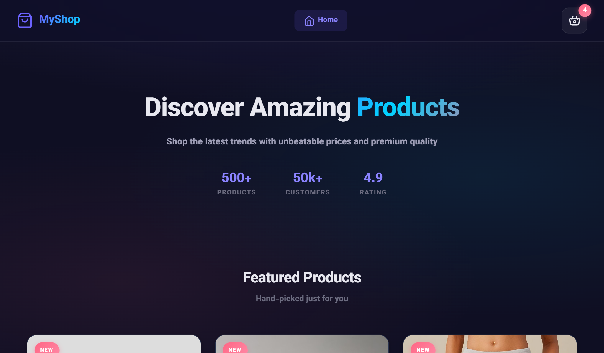

<div dir="rtl">

<div align="center">


<b>جلسه یازدهم</b>

</div>

<br><br>

# 🛒 فروشگاه آنلاین

### جلسه ۹ و ۱۰ — قالب فرانت‌اند فروشگاهی مدرن و واکنش‌گرا

<br>

[](https://developer.mozilla.org/en-US/docs/Web/HTML)
[](https://developer.mozilla.org/en-US/docs/Web/CSS)
[](https://developer.mozilla.org/en-US/docs/Web/JavaScript)
[](https://axios-http.com/)

[](https://opensource.org/licenses/MIT)
[](http://makeapullrequest.com)
[](https://github.com/username/repo/graphs/commit-activity)

<br>

</div>

> [!CAUTION]  
> ⚠️ **هشدار مهم**  
> این قالب صرفاً برای **مصارف آموزشی** تهیه شده است و بهتر است بدون بررسی کامل، تست‌های امنیتی و ملاحظات فنی لازم، به صورت تجاری استفاده نشود.

---


Version Control (VCS)

Command-Line application

Providers: Github, Gitlab, BitBucket, Azure DevOps , etc

```shell
git init

git add .

git commit -m "custom message"

git remote add origin https://github.com/miladxandi/neon-store.git

git push origin main
```

---

<div align="center">

ساخته شده با ❤️

⭐ اگر مفید بود، ستاره بدید!

</div>
```
